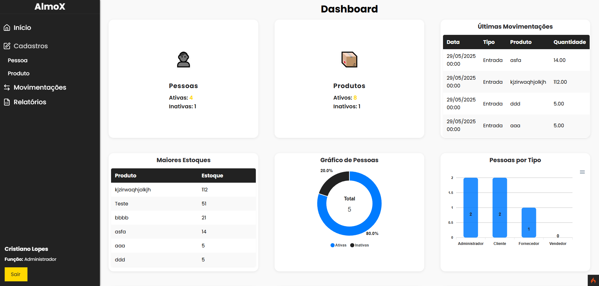

# 🗃️ AlmoX - Sistema de controle de estoque

---

**AlmoX** é um sistema de controle de estoque para almoxarifados, desenvolvido com **PHP (CodeIgniter 4)**, **MySQL** e **mPDF** para geração de relatórios em PDF.
O objetivo é facilitar o gerenciamento de pessoas, produtos, entradas e saídas de estoque, com foco em simplicidade, desempenho e usabilidade.

---

## 📸 Prévia da Interface



---

## 🔧 Tecnologias Utilizadas

-   ✅ **PHP 8.1+** com CodeIgniter 4
-   ✅ **MySQL 8**
-   ✅ **Composer** para gerenciamento de dependências
-   ✅ **mPDF** para geração de relatórios em PDF
-   ✅ **JavaScript nativo** para interações com modais e asides
-   ✅ **CSS moderno** e responsivo

---

## 📁 Estrutura do Projeto

```
/app
├── Controllers/
├── Models/
├── Views/
│   ├── layout.php
│   ├── home.php
│   ├── produtos.php
│   ├── usuarios.php
│   ├── movimentos/
│   └── partials/
├── scripts/
│   └── script001.sql
/public
│   ├── css/
│   ├── img/
│   ├── js/
│   └── svg/
.env
composer.json
README.md
```

---

## ✅ Funcionalidades

-   👤 Cadastro, edição e ativação/desativação de pessoas
-   📦 Cadastro e edição de produtos, categorias e unidades de medida
-   🔄 Controle de entradas e saídas de estoque (movimentações)
-   📊 Dashboard com gráficos e tabelas
-   🧾 Geração de relatórios em PDF (consultas dos dashboards, sem gráficos)
-   🌙 Formulários em modo **Aside** com overlay moderno, acessíveis de qualquer tela
-   🔍 Filtros e pesquisa
-   💾 Dados iniciais automáticos para acesso rápido

---

## ▶️ Como rodar localmente

### 1. Clone o repositório:

```bash
git clone https://github.com/lopes-cristiano/almox.git
cd almox
```

### 2. Instale as dependências do PHP (inclui mPDF):

```bash
composer install
```

### 3. Configure o banco de dados em `.env`:

```
database.default.hostname = localhost
database.default.database = almox
database.default.username = root
database.default.password =
database.default.DBDriver = MySQLi
```

### 4. Crie o banco e dados iniciais:

-   Importe o script SQL:

```bash
mysql -u root -p < app/scripts/script001.sql
```

-   Isso criará as tabelas e os dados iniciais, incluindo o usuário admin.

### 5. Rode o servidor:

```bash
php spark serve
```

### 6. Acesse no navegador:

[http://localhost:8080](http://localhost:8080)

---

## 👤 Usuário padrão para login

-   **Usuário:** admin@admin.com
-   **Senha:** 12345678 (hash já inserido no banco, altere se desejar)

---

## 📄 Geração de Relatórios em PDF

-   Acesse o formulário de relatórios pelo menu lateral ("Relatórios").
-   Escolha o tipo de relatório e o período (opcional).
-   O PDF é gerado a partir das mesmas consultas dos dashboards, apenas tabelas (sem gráficos).
-   O download é feito automaticamente.

---

## 🧩 Novidades e Recursos Avançados

-   Modal global para relatórios, acessível de qualquer tela
-   Todos os formulários seguem padrão visual e de acessibilidade
-   Responsividade aprimorada

---

## 📌 Padrões e Organização

-   Estrutura **MVC** (Model-View-Controller)
-   Organização modular por componentes reutilizáveis
-   Separação clara entre controle, visualização e regra de negócio
-   Uso de partials para formulários e modais

---

## 🗃️ Dados padrão inseridos no banco

-   Tipos de pessoa: Administrador, Cliente, Fornecedor, Vendedor
-   Usuário admin: admin@admin.com (senha: 12345678)
-   Estrutura pronta para produtos, categorias, unidades, movimentações

---

## ✨ Possíveis Melhorias Futuras

-   🔐 Autenticação com permissões (ACL)
-   📱 Responsividade total para mobile
-   📄 Relatórios customizáveis
-   📊 Dashboard com gráficos interativos
-   📦 Importação/exportação de dados

---

## 🤝 Contribuição

Sinta-se à vontade para contribuir com melhorias ou sugestões!  
Basta abrir um **Pull Request** ou registrar uma **Issue** neste repositório.

---

## ⭐ Licença

Este projeto é open-source sob a licença MIT.
